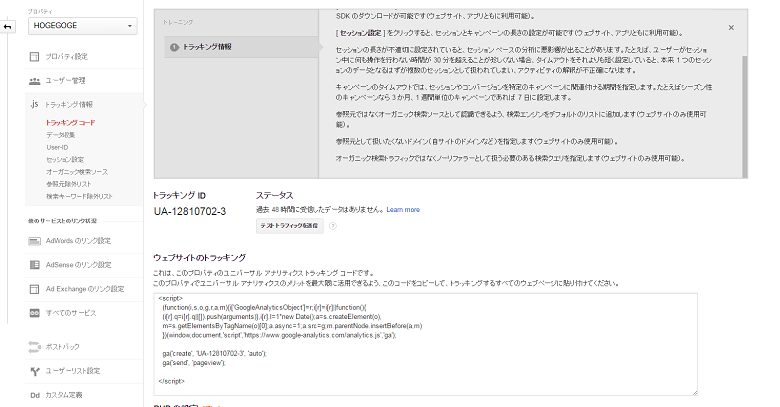
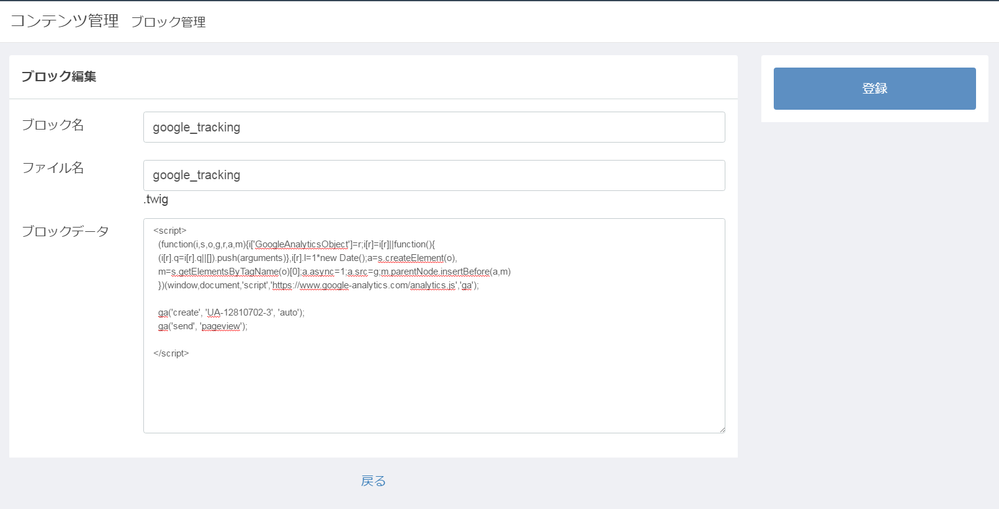
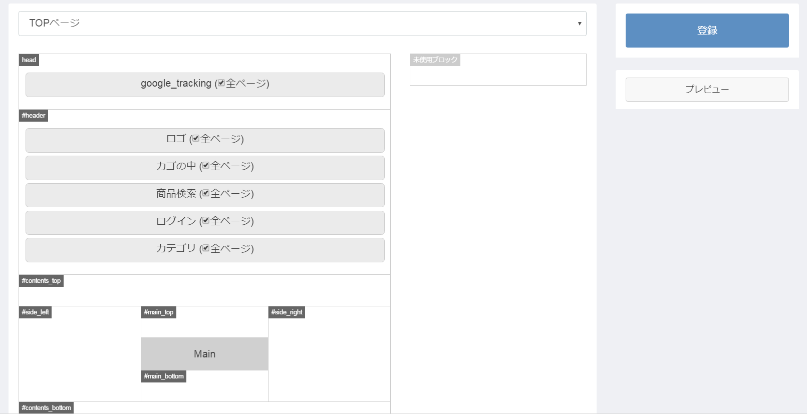

---

# {{ page.title }}

## 本章で行うこと

1. 本章では、管理画面の「ブロック管理・コンテンツ管理」を利用して、JavaScriptを追加する方法を説明します。

1. 追加する、JavaScriptとして、よく利用されるであろう、「GoogleAnalitics」のトラッキングタグを追加します。

## カスタマイズで行うこと

1. ブロックの追加

1. ページレイアウト編集

1. GoogleAnaliticsでの確認

1. コンバージョンの設定

1. GoogleAnaliticsでの確認

## 前提条件

1. GoogleAnaliticsのアカウントは事前に取得しているものとします。

1. 該当GoogleAnaliticsアカウントで事前にサイト登録が完了しているものとします。

1. 事前にGoogleAnaliticsアカウントで、「トラッキングタグ」を発行しているものとします。

## ブロックの追加

- 管理画面にログインし、ブロックを追加していきます。

1.管理画面メニュー > コンテンツ管理 > ブロック管理をクリックします。

2.ブロック管理画面の「新規入力」ボタンを押下します。

---

---

3.GoogleAnaliticsのトラッキングタグ取得ページにアクセスして、トラッキングタグをコピーします。
- ブロック名・Twig名は任意で入力します。

---

---

---

---

4.コピー後、登録ボタンを押下し、ブロック登録を完了します。

## ページレイアウト編集

1.管理画面メニュー > コンテンツ管理 > ページ管理をクリックします。

2.表示されたページの最上段「TOPページ」行、右横の「・・・」内メニュー「レイアウト編集」をクリックします。

3.以下レイアウト管理画面の様に、画面右部の「未使用ブロック」内に作成したブロックが表示されています。

4.「全ページ」にチェックをつけ、画面左部分の「head」の位置へドラッグアンドドロップを行います。

---

---

5.「登録ボタン」を押下して登録を完了します。

6.ユーザー画面、「TOPページ」を開き、ページのソースを表示し、「トラッキングタグ」を確認します。

---

---

## コンバージョン画面の設定

- 購入完了画面を対象画面とします。

1.GoogleAnalitics管理画面にアクセスします。

2.メニュー「アナリティクス設定」をクリックします。

3.ビュー欄、「目標」をクリックします。

4.「目標設定」で「テンプレート・注文」、「タイプ」は到達ページ、「目標の詳細」の「到達ページ」には「/[EC-CUBE 3インストールディレクトリ]/html/shopping/complete」の「正規表現」を設定します。

## GoogleAnaliticsでの確認

### トラックングタグ確認

1.EC-CUBE 3のトップページに遷移後、GoogleAnaliticsのメニュー「レポート」をクリックします。

---

---

2.画面左メニュー「リアルタイム > サマリー」をクリックし、以下の様にアクティブユーザーが「1」になっていれば、設定は成功です。

---

---

### コンバージョン確認

1.EC-CUBE 3ユーザー画面で購入完了を終えます。

8.GoogleAnaliticsの画面左メニュー「リアルタイム > コンバージョン」をクリック

9.画面下部の目標のヒット数が「100.00%」になっていれば、設定成功です。

---

---

## 備考

1.Js取り込みの参考元

<a href="http://qiita.com/Geany/items/a1bea004f170d69af6c6" target="_blank">【EC-CUBE 3/非公式手法】フロントエンド全画面にJSでゴキゲン ( 簡易版 )</a>
