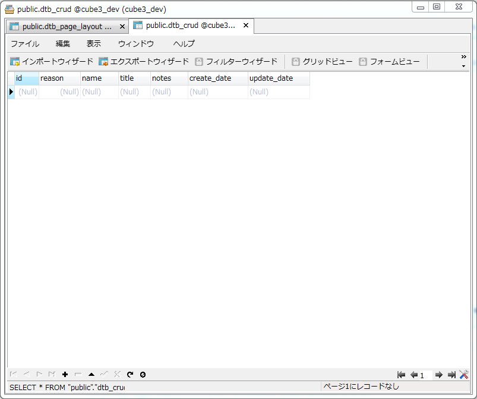

---

# データーベースを作成しよう

## 本章メニュー

- 本章では以下を行います。

    1. テーブル定義を記述するマイグレーションファイルの作成方法を説明します。

    1. ルーティングの設定
        - コントローラーとURLの紐付け方を説明します。

## 本チュートリアルのテーブル定義

- 目次で示した様に、本章ではテーブル定義の内容についてのみ説明をおこいます。

- テーブル定義は**マイグレーションファイル**に記述していきます。

## マイグレーションファイルの準備

1. トップページに記述されている「マイグレーションガイド」の「マイグレーション作成手順」の内容に基づき、新しいマイグレーションファイルを作成します。

    - 内容に基づき生成を行うと以下フォルダに作成されます。
    - 保存フォルダ
      - /src/Eccube/Resource/doctrine/migration

1. 以下ファイルが出来ているか確認してください。
    - **Version20160607155514.php**

    - 下記に内容を記述します。
    - 「up」メソッドと「down」メソッドが記載されています。

```
<?php

namespace DoctrineMigrations;

use Doctrine\DBAL\Migrations\AbstractMigration;
use Doctrine\DBAL\Schema\Schema;

/**
 * Auto-generated Migration: Please modify to your needs!
 */
class Version20160607155514 extends AbstractMigration
{
    /**
     * @param Schema $schema
     */
    public function up(Schema $schema)
    {
        // this up() migration is auto-generated, please modify it to your needs
        ★ここにテーブル定義を追記

    }

    /**
     * @param Schema $schema
     */
    public function down(Schema $schema)
    {
        // this down() migration is auto-generated, please modify it to your needs
        ★ここのテーブル定義を削除

    }
}
```

## 今回チュートリアルのテーブル定義

- テーブル名 : dtb_bbs

| 論理名 | 物理名 | フィールドタイプ | その他 |
|------|------|------|------|
| 投稿ID | id | int | NOT NULL PRIMARY AUTO_INCREMENT |
| 親投稿ID | parent_id | int | DEFAULT NULL |
| 投稿種別 | reason | smallint | NOT NULL |
| 投稿者ハンドルネーム | name | varchar(255) | NOT NULL |
| 投稿のタイトル | title | varchar(255) | NOT NULL |
| 投稿種別 | notes | text | DEFAULT NULL |
| 投稿登録時間 | created | datetime | NOT NULL |
| 投稿編集時間 | updated | datetime | NOT NULL |

- 上記のテーブル定義を以下に記述していきます

```
<?php

namespace DoctrineMigrations;

use Doctrine\DBAL\Migrations\AbstractMigration;
use Doctrine\DBAL\Schema\Schema;

/**
 * Auto-generated Migration: Please modify to your needs!
 */
class Version20160607155514 extends AbstractMigration
{
    /**
     * @param Schema $schema
     */
    public function up(Schema $schema)
    {
        if (!$schema->hasTable('dtb_bbs')) {
            $table = $schema->createTable('dtb_bbs');
            $table->addColumn('id', 'integer', array(
                'autoincrement' => true,
            ));
            $table->addColumn('parent_id', 'integer', array('NotNull' => false, 'default' => 'null'));
            $table->addColumn('reason', 'smallint', array('NotNull' => true));
            $table->addColumn('name', 'string', array('NotNull' => true, 'length' => 255));
            $table->addColumn('title', 'string', array('NotNull' => true, 'length' => 255));
            $table->addColumn('notes', 'text', array('default' => 'null'));
            $table->addColumn('create_date', 'datetime', array('NotNull' => true));
            $table->addColumn('update_date', 'datetime', array('NotNull' => true));
            $table->setPrimaryKey(array('id'));
        }
    }

    /**
     * @param Schema $schema
     */
    public function down(Schema $schema)
    {
        if (!$schema->hasTable('dtb_bbs')) {
            $schema->dropTable('dtb_bbs');
        }
    }
}
```

- 上記の説明を行います。

- メソッドの引数に**$schema**変数が存在しますが、テーブル操作を行うためのオブジェクトです。

    1. はじめに、**hasTable**メソッドを用いて、**今回テーブルの有無**を確認しています。
    1. テーブルが存在しない場合のみ**createTable**メソッドで**テーブルを作成**します。
    1. テーブルを作成した後は、テーブルスキーマを確認しながら、**addColumn**メソッドでカラムを追加していきます。
    1. 最後に、**setPrimaryKey**でプライマリーキーを指定しています。
    1. 次に「down」メソッド時の**dropTable**メソッドでテーブルを削除しています。

- 上記が完了したら、「マイグレーションガイド」の「マイグレーション受け入れ手順」の章を参照しその内容を実行してください。

- 成功すれば以下の様にテーブルが作成されているはずです。

---



---

## 本章で学んだこと

1. コンソールから空の「マイグレーションファイル」を作成しました。
1. テーブル構造を検討しました。
1. 「マイグレーションファイル」の「schemaオブジェクト」でデーターベース操作をおこないました。
1. 「schema」オブジェクトで「createTable」「hasTable」「addColumn」「setPrimaryKey」「dropTable」のメソッドを使いテーブルを構築しました。
